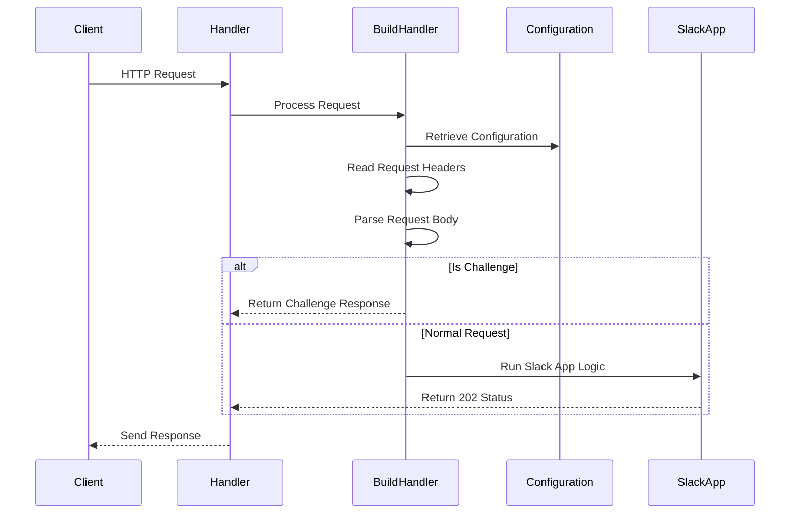

## Sequence Diagram

```mermaid
sequenceDiagram
    participant Client
    participant Handler
    participant BuildHandler
    participant Configuration
    participant SlackApp

    Client->>Handler: HTTP Request
    Handler->>BuildHandler: Process Request
    BuildHandler->>Configuration: Retrieve Configuration
    BuildHandler->>BuildHandler: Read Request Headers
    BuildHandler->>BuildHandler: Parse Request Body
    alt Is Challenge
        BuildHandler-->>Handler: Return Challenge Response
    else Normal Request
        BuildHandler->>SlackApp: Run Slack App Logic
        SlackApp-->>Handler: Return 202 Status
    end
    Handler-->>Client: Send Response
```
